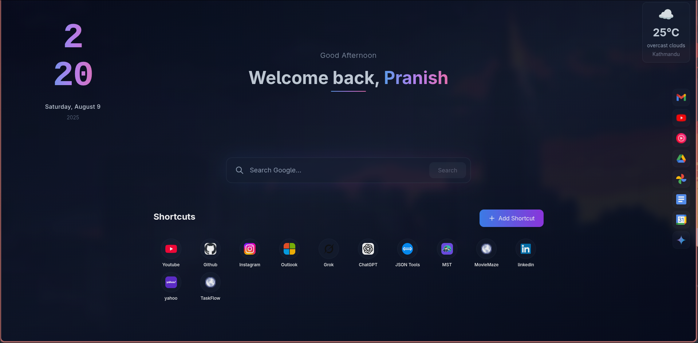

# Custom New Tab - Chrome Homepage Extension

A customizable, minimalist Chrome new tab homepage built with React and Tailwind CSS.
This extension provides quick access to shortcuts, Google apps, weather, a live clock, and a personalized welcome message — all with smooth animations and modern styling.

---

## Demo

Live demo available on GitHub Pages:
https://nika-commits.github.io/custom-new-tab/

---

## Features

- Replace the default Chrome new tab with a custom React homepage
- Dynamic live clock with time and date
- Personalized welcome message with gradient text
- Search bar and Google Apps shortcuts
- Real-Time weather widget integration using Open Weather API
- Responsive and modern UI powered by Tailwind CSS
- Smooth fade-in animations for components
- LocalStorage support for user shortcuts and preferences

---

## Screenshots

## 

## Important Notes

- Some browser extensions like **Dark Reader** or other style-modifying extensions can interfere with the appearance of the site by altering colors, gradients, or visibility of elements. If you notice missing gradients, text, or other styling issues, try disabling such extensions or whitelist this site.
- Browser caching can sometimes prevent seeing the latest changes. Use incognito mode or clear cache to ensure the newest version loads correctly.

---

## Technologies Used

- React
- Tailwind CSS
- Vite
- GitHub Pages for hosting

---

## Author

Pranish Chaulagain
[GitHub Profile](https://github.com/Nika-commits)
[Email: itismepranish@gmail.com](mailto:itismepranish@gmail.com)

---

## License

MIT License
